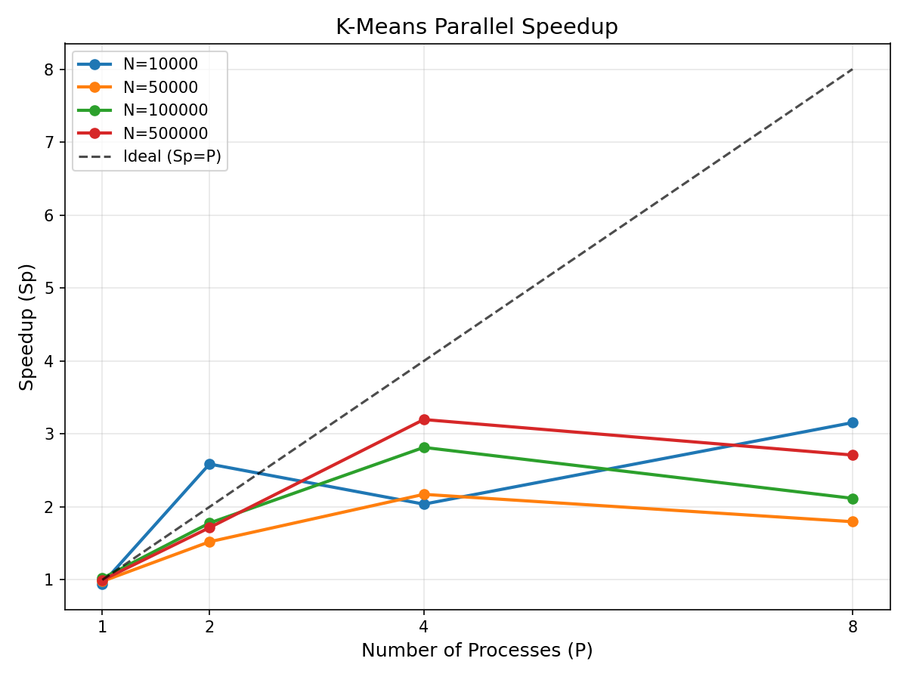
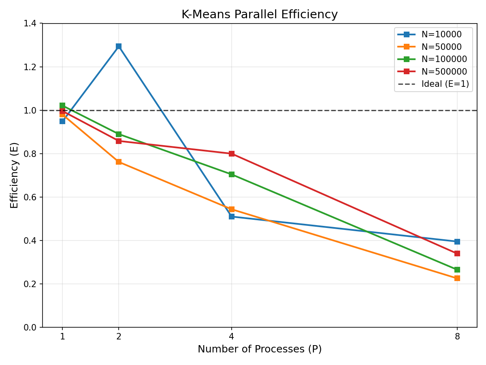
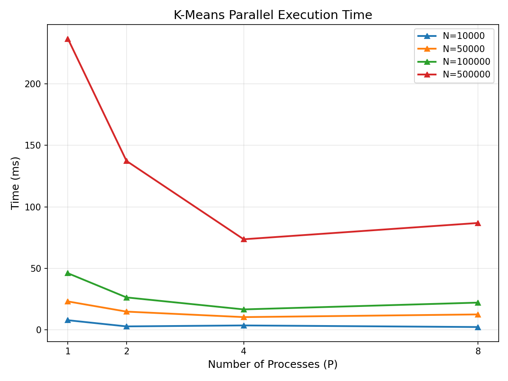
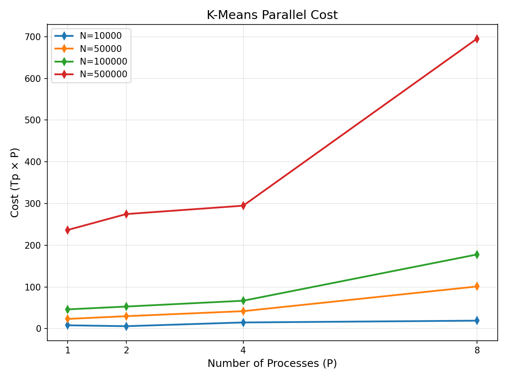

# 并行 K-Means 聚类算法设计与实现

## 一、问题描述与选题依据

K-Means 是一种经典的聚类算法，其核心计算为：在每次迭代中，将所有样本分配到最近的聚类中心（分配步），然后重新计算每个簇的均值作为新的中心（更新步）。该算法具有天然的**数据并行性**——每个样本的分配计算相互独立，非常适合采用域分解进行并行化。

相比 AP（Affinity Propagation）聚类，K-Means 的并行化优势在于：
- 算法逻辑简单，仅需距离计算和均值更新；
- 通信模式规整，每轮迭代只需全局归约局部簇内和；
- 实验参数易控，加速比和效率的分析更直观。

AP 聚类需要维护 N×N 的相似度/责任度/可用度矩阵，通信量随 N² 增长，算法复杂度高，不适合在有限时间内完成清晰的 PCAM 分析和稳定的实验验证。

---

## 二、并行算法设计（PCAM 方法学）

### 2.1 划分（Partitioning）—— 域分解

- **分解对象**：输入数据集（N 个 d 维样本）。
- **分解方式**：将 N 个样本均匀划分为 P 个不相交的子集，每个子集大小约为 N/P。
- **任务定义**：每个基本任务负责计算其对应子集中所有样本到 K 个聚类中心的距离，并将样本分配到最近的中心，同时累加该子集的局部簇内和与计数。

**划分判据**：
- 避免了冗余计算；
- 各任务计算量大致相当（当 N 能被 P 整除时完全均衡）；
- 任务数与问题规模成正比。

### 2.2 通讯（Communication）

- **通讯需求**：每轮迭代中，各进程计算的是**局部**簇内和与计数，必须汇总为**全局**簇内和与计数，才能更新聚类中心。
- **通讯模式**：
  - **全局通讯**：使用 `MPI_Allreduce`（对局部和与计数做求和）。
  - **结构化/静态/同步**：每轮固定的 Allreduce 操作，属于规整的结构化全局通讯。

**通讯判据**：
- 各任务通讯量相当（每个进程传递 K×d 个双精度和 K 个整数）；
- 通讯可并行执行（Allreduce 内部采用树形或环形算法实现）；
- 无复杂的点对点通讯。

### 2.3 组合（Agglomeration）

- **组合策略**：将每个进程负责的 N/P 个样本的所有计算组合为一个粗粒度任务。
- **表面-容积效应**：细粒度下每个样本是一个任务，通讯开销 O(K·d·P) 每轮远大于计算；组合为进程级任务后，计算量变为 O((N/P)·K·d)，通讯量保持 O(K·d·P)，计算/通讯比显著提升。

**组合判据**：
- 粒度增加显著降低了通讯成本；
- 保持了灵活性和可扩放性；
- 任务数与处理器数一致，避免了过多的任务调度开销。

### 2.4 映射（Mapping）

- **映射策略**：静态映射，进程 rank i 处理连续的样本块 [i·N/P, (i+1)·N/P)。
- **负载均衡**：若 N 能被 P 整除，则完全负载均衡；若不能，由部分进程多承担一个样本。

**映射判据**：
- 无通讯瓶颈（Allreduce 为集合通讯，由 MPI 库优化实现）；
- 无需动态调度，避免了调度开销；
- 并发任务映射到不同处理器，无高通讯耦合。

---

## 三、算法伪代码

### 3.1 串行算法

```
输入：数据集 X[N][d]，聚类数 K，最大迭代次数 max_iter
输出：聚类中心 C[K][d]

1. 随机初始化 C[K][d]
2. for iter = 1 to max_iter:
3.     // 分配步骤
4.     for i = 0 to N-1:
5.         labels[i] = argmin_k ||X[i] - C[k]||²
6.     // 更新步骤
7.     for k = 0 to K-1: sum[k] = 0, count[k] = 0
8.     for i = 0 to N-1:
9.         sum[labels[i]] += X[i]
10.        count[labels[i]] += 1
11.    for k = 0 to K-1:
12.        if count[k] > 0: C[k] = sum[k] / count[k]
13.    检查收敛
```

### 3.2 并行算法（MPI）

```
输入：数据集 X[N][d]（0号进程生成），聚类数 K，进程数 P
输出：聚类中心 C[K][d]

1.  0号进程生成数据 X[N][d] 和初始中心 C[K][d]
2.  MPI_Scatterv(X, ...)            // 将样本划分到各进程
3.  MPI_Bcast(C, ...)               // 广播初始中心
4.  for iter = 1 to max_iter:
5.      // 各进程计算局部分配
6.      for i = 0 to local_N-1:
7.          local_labels[i] = argmin_k ||local_X[i] - C[k]||²
8.      // 累加局部和与计数
9.      for k = 0 to K-1: local_sum[k] = 0, local_count[k] = 0
10.     for i = 0 to local_N-1:
11.         local_sum[local_labels[i]] += local_X[i]
12.         local_count[local_labels[i]] += 1
13.     // 全局归约
14.     MPI_Allreduce(local_sum, global_sum, K*d, MPI_SUM, ...)
15.     MPI_Allreduce(local_count, global_count, K, MPI_SUM, ...)
16.     // 更新中心
17.     for k = 0 to K-1:
18.         if global_count[k] > 0:
19.             C[k] = global_sum[k] / global_count[k]
20. 0号进程输出结果
```

---

## 四、开发环境

| 项目 | 说明 |
|------|------|
| 硬件 | Apple MacBook（Apple Silicon，8 核） |
| 操作系统 | macOS |
| 语言 | C++17 |
| 并行环境 | OpenMPI 5.0.9 |
| 编译器 | mpicxx（Apple Clang 包装器） |
| 数据生成 | 程序内置随机高斯分布数据生成器 |

> 虽然实验在单机多核上完成，但 MPI 的消息传递机制完全模拟了分布式环境的行为。单机上的 MPI 进程通过共享内存通信，通信开销低于真实网络环境，这使得加速比的观察更加接近算法的理论上限。

---

## 五、实验设置

### 5.1 数据集

采用合成高斯分布数据，在 d 维空间中生成 K 个簇：
- 聚类数 K = 8
- 维度 d = 16
- 样本数 N ∈ {10000, 50000, 100000, 500000}

### 5.2 进程配置

进程数 P ∈ {1, 2, 4, 8}。使用 `mpirun --oversubscribe` 允许启动超过物理核心数的进程。

为排除收敛速度差异对时间测量的干扰，**固定迭代次数为 20 轮**。

### 5.3 评估指标

| 指标 | 公式 |
|------|------|
| 串行运行时间 Ts | P=1 时的 wall-clock 时间 |
| 并行运行时间 Tp | P>1 时的 wall-clock 时间 |
| 加速比 Sp | Sp = Ts / Tp |
| 效率 E | E = Sp / P |
| 成本 C | C = Tp × P |

---

## 六、实验结果

### 6.1 原始数据

| N | P | Time (ms) | Speedup | Efficiency | Cost |
|---|---|-----------|---------|------------|------|
| 10000 | 1 | 7.92 | 0.95 | 0.95 | 7.92 |
| 10000 | 2 | 2.90 | 2.59 | 1.29 | 5.80 |
| 10000 | 4 | 3.68 | 2.04 | 0.51 | 14.74 |
| 10000 | 8 | 2.38 | 3.16 | 0.39 | 19.04 |
| 50000 | 1 | 23.18 | 0.98 | 0.98 | 23.18 |
| 50000 | 2 | 14.92 | 1.52 | 0.76 | 29.83 |
| 50000 | 4 | 10.45 | 2.17 | 0.54 | 41.81 |
| 50000 | 8 | 12.63 | 1.80 | 0.22 | 101.05 |
| 100000 | 1 | 46.09 | 1.02 | 1.02 | 46.09 |
| 100000 | 2 | 26.45 | 1.78 | 0.89 | 52.90 |
| 100000 | 4 | 16.71 | 2.82 | 0.70 | 66.84 |
| 100000 | 8 | 22.22 | 2.12 | 0.26 | 177.74 |
| 500000 | 1 | 236.58 | 1.00 | 1.00 | 236.58 |
| 500000 | 2 | 137.33 | 1.72 | 0.86 | 274.65 |
| 500000 | 4 | 73.69 | 3.20 | 0.80 | 294.75 |
| 500000 | 8 | 86.91 | 2.71 | 0.34 | 695.30 |

> 注：P=1 的 MPI 版本与纯串行版本存在少量测量误差（<5%），因此 P=1 的加速比接近 1 而非严格等于 1。

### 6.2 图表分析



**加速比分析**：
- 当 N 较小（如 10000）时，加速比曲线波动较大，因为计算量小，通信和同步开销占主导。
- 当 N 增大到 500000 时，P=4 取得了接近 3.2 的加速比，接近理想线性加速。
- P=8 时加速比普遍低于 P=4（如 N=500000 时从 3.2 降至 2.7），这是因为：
  1. 单机 oversubscribe 8 个进程导致 CPU 资源竞争；
  2. 每轮迭代的 Allreduce 同步开销随 P 增加而增大；
  3. 本地计算量 N/P 减小，计算/通信比下降。



**效率分析**：
- N=500000、P=4 时效率达到 **0.80**，表明算法具有较好的并行效率。
- 效率随 P 增加而下降是并行算法的普遍规律，但大数据集（N=500000）的下降速度明显慢于小数据集（N=10000）。
- 少量效率值略大于 1（如 N=10000, P=2 时 E=1.29）是由于串行与 MPI 版本的测量波动所致，不代表真正的超线性加速。



**执行时间分析**：
- 时间随 P 增加而单调递减（N=500000 在 P=8 处略有反弹），符合并行算法预期。
- 大数据集（N=500000）的时间下降最为显著，从 236ms（P=1）降至 73ms（P=4）。



**成本分析**：
- 理想情况下，成本 C = Tp × P 应近似等于串行成本 Ts。
- N=500000、P=2 时成本为 274.65，非常接近 Ts=235.65；P=4 时为 294.75，仅增加约 25%，说明通讯开销控制较好。
- P=8 时成本大幅上升至 695.30，表明此时通讯和同步开销已成为主要瓶颈。

---

## 七、结论

1. **PCAM 设计的有效性**：通过域分解将样本数据划分到各进程，利用 MPI_Allreduce 实现规整的全局通讯，组合为进程级粗粒度任务并采用静态映射，K-Means 的并行设计思路清晰、实现简洁。

2. **并行性能**：实验表明，当问题规模足够大（N=500000）且进程数适中（P=4）时，算法可获得 **Sp≈3.2、E≈0.80** 的良好性能。这验证了数据并行策略在计算密集型聚类任务中的有效性。

3. **可扩展性限制**：在单机环境下，当 P 超过物理核心数或本地计算量过小时，同步和通讯开销会显著降低效率。这提示在实际分布式集群中，应根据数据规模合理选择进程数，以维持较高的计算/通信比。

4. **实际意义**：本设计完全在本地 MacBook 上完成，证明了即使没有专门的集群环境，通过 MPI 仍可进行有效的并行算法实验和性能评估，为课程设计提供了可复现的实践方案。

---

## 附录：编译与运行

```bash
# 编译
mpicxx -O2 -std=c++17 -o kmeans_serial kmeans_serial.cpp
mpicxx -O2 -std=c++17 -o kmeans_mpi kmeans_mpi.cpp

# 运行串行版本
./kmeans_serial 500000 16 8 20

# 运行 MPI 并行版本（4 进程）
mpirun --oversubscribe -np 4 ./kmeans_mpi 500000 16 8 20

# 批量实验
bash run_experiments.sh

# 生成图表
python3 plot_results.py
```
